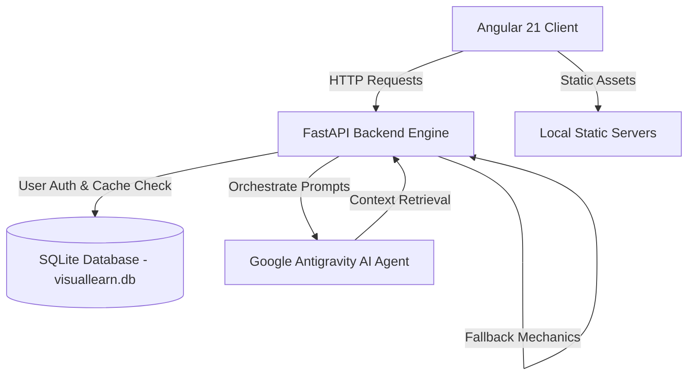

# 🎓 VisualLearn AI - Intelligent Educational Video Workspace

VisualLearn AI is a next-generation, AI-powered interactive learning ecosystem. It transforms dry educational topics into immersive, media-rich study workspaces complete with concept summaries, interactive quizzes, gamified statistics, and an AI-driven "Ask Anything" chat assistant.

This capstone project is built using a modern **FastAPI (Python) backend** and an **Angular 21 frontend**.

---

## 💡 Project Idea & Core Concept

Traditional online education often suffers from a lack of active engagement—students watch a video passively and lose focus. **VisualLearn AI** bridges this gap by turning learning into a multi-modal, active experience:
1. **Dynamic Workspace Generation**: A student inputs any topic (e.g., *Photosynthesis*, *Quantum Mechanics*, *Solar System*). 
2. **Contextual Video Loops**: The engine automatically binds the topic to high-quality visual aids, science animations, or YouTube lessons.
3. **Structured Syntheses**: Generates key concept points and recommended sub-lessons.
4. **Active Recall (MCQs)**: Generates customized multiple-choice tests to evaluate understanding in real-time.
5. **Interactive Q&A ("Ask Anything")**: An embedded chat assistant allows students to ask complex questions directly about the active topic and video summary.
6. **Gamification & Analytics**: Accumulates Experience Points (XP), tracks learning streaks, and logs quiz statistics to keep students motivated.

---

## 🛠️ System Architecture



### 1. Frontend (Angular 21)
- **Framework**: Angular 21 with a clean component-based layout.
- **Key Modules**:
  - `login`: Secured JWT-based login entrypoint.
  - `dashboard`: Main workspace interface hosting key points, YouTube embeds, and progress tracking.
  - `quiz`: Interactive 10-question evaluation panel.
  - `library` & `history`: Repository of previous topics and scores.
  - `analytics`: Performance monitoring and XP overview.

### 2. Backend (FastAPI)
- **Framework**: FastAPI (Python 3.10+) with asynchronous database querying.
- **AI Integration**: Custom Google Antigravity Agent orchestration with automatic local fallback engines for unauthenticated or throttled states.
- **Authentication**: JWT token verification gateway.
- **Database (SQLAlchemy + SQLite)**: Async session connection (`aiosqlite`) mapping user quiz scores and caching AI-generated workspaces.

---

## 🚀 Step-by-Step Implementation Guide

Follow these steps to set up and run the project locally on your machine.

### Prerequisites
- **Python 3.10 or higher** installed.
- **Node.js (v18+)** and **npm** installed.
- **Git** installed.

---

### Step 1: Clone and Inspect Directory Structure
Ensure your workspace matches the following structure:
```text
capstone-project/
├── backend/                  # Python FastAPI codebase
│   ├── main.py               # Main API routes and lifespan configuration
│   ├── database.py           # SQLite connection and SQLAlchemy models
│   ├── requirements.txt      # Backend Python dependencies
│   ├── .env                  # Port, Keys, and AI configurations
│   └── static/               # Local video backgrounds & static loops
├── frontend/                 # Angular 21 codebase
│   └── educational-interface/
│       ├── src/              # App components, services, and styles
│       ├── package.json      # Node dependencies
│       └── angular.json      # Angular workspace configurations
├── .gitignore                # Global ignore file
└── README.md                 # Project documentation (This file)
```

---

### Step 2: Configure and Run Backend

1. Navigate to the root directory and create a Python virtual environment:
   ```bash
   python -m venv .venv
   ```

2. Activate the virtual environment:
   - **Windows (PowerShell)**:
     ```powershell
     .venv\Scripts\Activate.ps1
     ```
   - **macOS/Linux**:
     ```bash
     source .venv/bin/activate
     ```

3. Install required Python packages:
   ```bash
   pip install -r backend/requirements.txt
   ```

4. Create a `.env` configuration file inside the `backend/` directory:
   ```env
   SECRET_KEY=ANTIGRAVITY_PROPULSION_VECTOR_SECRET
   ALGORITHM=HS256
   ```

5. Launch the FastAPI server:
   ```bash
   python backend/main.py
   ```
   *The backend will boot up at **`http://localhost:8000`**. You can verify it works by opening **`http://localhost:8000/docs`** to see the interactive Swagger API documentation.*

---

### Step 3: Configure and Run Frontend

1. Open a new terminal and navigate to the frontend folder:
   ```bash
   cd frontend/educational-interface
   ```

2. Install the frontend dependencies:
   ```bash
   npm install
   ```

3. Launch the Angular development server:
   ```bash
   ng serve --open
   ```
   *This compiles the Angular app and opens it in your default browser at **`http://localhost:4200`**.*

---

### Step 4: Login and Start Learning

1. When the app opens, you will see a secure **Login screen**.
2. Enter the default credentials:
   - **Username**: `narendra`
   - **Password**: `admin123`
   *(Alternatively, you can register any new operator with a username longer than 3 characters and a password longer than 4 characters).*
3. Type a topic in the search bar (e.g., `Solar System`) and click **Generate Workspace** to test the system!

---

## 💾 Database Schema

The database `visuallearn.db` contains two primary tables:
- **`workspace_cache`**: Caches previously requested topics to reduce AI latency and enable offline usability.
- **`quiz_results`**: Persists user scores, correct answer counts, topics, and completion timestamps.

```sql
-- Schema Overview
CREATE TABLE workspace_cache (
    id INTEGER PRIMARY KEY AUTOINCREMENT,
    prompt TEXT UNIQUE NOT NULL,
    topic TEXT NOT NULL,
    subject TEXT NOT NULL,
    grade TEXT NOT NULL,
    video_url TEXT NOT NULL,
    key_points TEXT NOT NULL,  -- Stored as JSON Text
    quiz_data TEXT NOT NULL    -- Stored as JSON Text
);

CREATE TABLE quiz_results (
    id INTEGER PRIMARY KEY AUTOINCREMENT,
    username TEXT NOT NULL,
    topic TEXT NOT NULL,
    score INTEGER NOT NULL,
    correct_count INTEGER NOT NULL,
    timestamp DATETIME DEFAULT CURRENT_TIMESTAMP
);
```

---

## 📦 Pushing Changes to GitHub

Whenever you make updates to the code, use the following commands to push your progress to your remote repository:

```bash
# Check modified files
git status

# Stage all changes
git add .

# Commit changes
git commit -m "feat: updated project documentation and README"

# Push to your main branch
git push origin main
```
