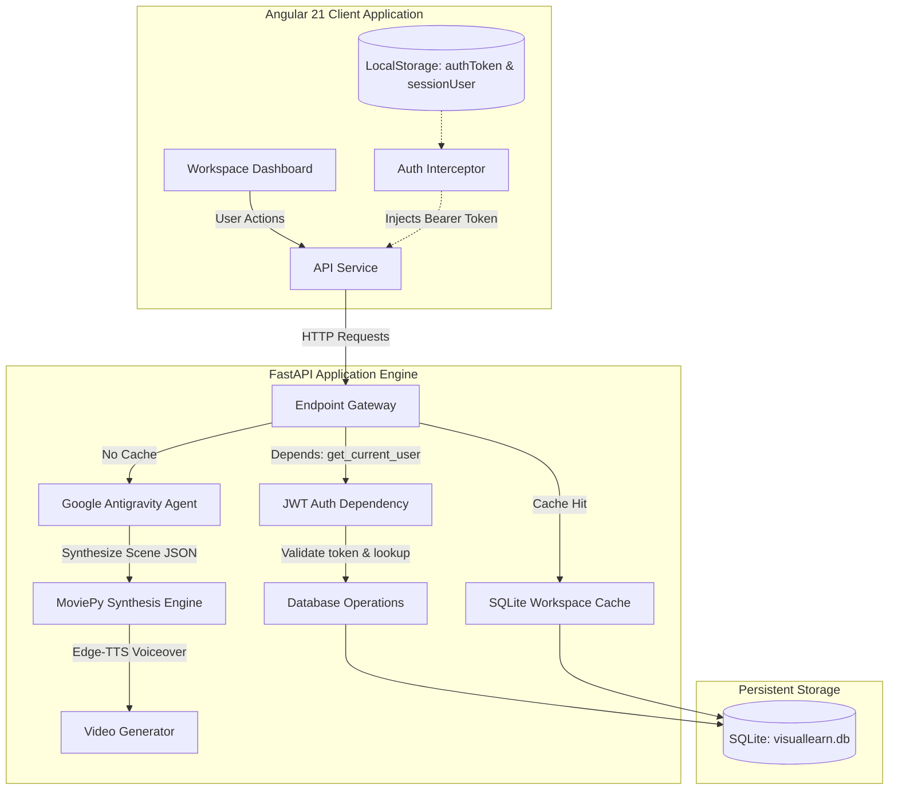

# 🎓 VisualLearn AI - Intelligent Educational Video Workspace

[](https://www.python.org/)
[](https://fastapi.tiangolo.com/)
[](https://angular.dev/)
[](https://opensource.org/licenses/MIT)

VisualLearn AI is a next-generation interactive learning ecosystem that transforms dry educational topics into immersive, media-rich study workspaces. By combining dynamic Google Gemini AI synthesis, local video generation, active recall testing, and real-time chat, it turns passive video consumption into an active, gamified learning experience.

---

## ✨ Features

- **🧠 Gemini AI Workspace Synthesis**: Enter any topic to immediately generate structured summaries, key concept cards, and customized lesson roadmaps.
- **🎥 Automated AI Video Generation**: Programmatically synthesizes educational slideshow videos with Pillow graphics, MoviePy transitions, and natural text-to-speech voiceovers using `edge-tts`.
- **📝 Real-time Quiz Generation**: Creates custom 10-question multiple-choice evaluations dynamically matched to the active topic to test retention.
- **💬 Contextual AI "Ask Anything" Chat**: Embedded assistant answers questions directly using the generated video summaries.
- **🔒 Secure JWT Authentication**: Full end-to-end security architecture utilizing `bcrypt` password hashing and backend JWT signature verification.
- **⚡ Cache-On-Miss Persistence**: Automatically stores generated workspaces in SQLite via SQLAlchemy Async (`aiosqlite`) to deliver instant subsequent loads and work offline.
- **📈 Learning Progress Analytics**: Track learning streaks, total Experience Points (XP), and average score logs in an interactive student dashboard.

---

## 🛠️ System Architecture



### Tech Stack Details

| Layer | Tech / Tool | Details |
| :--- | :--- | :--- |
| **Backend** | FastAPI | Asynchronous Python framework with auto-docs (Swagger) |
| **Frontend** | Angular 21 | Modern component-based web framework using Standalone design |
| **AI Integration** | Google Antigravity | Declarative orchestration agent for LLM multi-modal generation |
| **Video Production**| MoviePy + edge-tts | Local video compilation with high-fidelity speech synthesis |
| **Database** | SQLite + SQLAlchemy | Non-blocking database transactions via `aiosqlite` |

---

## 🚀 Quick Start

### Option 1: Manual Setup

#### Prerequisites
- **Python 3.10+**
- **Node.js 18+** & **npm**

#### 1. Setup Backend Engine
```bash
# Clone the repository
git clone https://github.com/Narendrakillari/capstone-project.git
cd capstone-project

# Setup virtual environment
python -m venv .venv
# On Windows:
.venv\Scripts\activate.ps1
# On macOS/Linux:
source .venv/bin/activate

# Install dependencies
pip install -r backend/requirements.txt

# Create your configuration
cp .env.example backend/.env
# Update backend/.env with your secrets: SECRET_KEY and GEMINI_API_KEY
```

To run the backend server:
```bash
uvicorn backend.main:app --reload --port 8000
```
*Verify Swagger docs are active at `http://localhost:8000/docs`*

#### 2. Setup Frontend Application
```bash
cd frontend/educational-interface
npm install
npm run start
```
*This starts the Angular app on `http://localhost:4200`.*

---

### Option 2: Docker Setup

Start the entire stack (FastAPI backend + Angular frontend + SQLite storage) with a single command:

```bash
# Run from the project root directory
docker-compose up --build
```

---

## 🔑 Environment Variables Reference

A `.env` file must be placed in the `backend/` directory:

| Variable | Required | Default | Description |
| :--- | :---: | :---: | :--- |
| `SECRET_KEY` | Yes | - | Secret key used to sign and verify authentication JWT tokens |
| `ALGORITHM` | No | `HS256` | Encryption algorithm to sign JWT payloads |
| `TOKEN_EXPIRATION_HOURS` | No | `24` | Duration in hours before JWT token expires |
| `GEMINI_API_KEY` | Yes | - | Google Gemini API Key obtained from AI Studio |

---

## 🔌 API Endpoints Reference

| Method | Endpoint | Auth Required | Description |
| :--- | :--- | :---: | :--- |
| `POST` | `/api/auth/register` | ❌ No | Registers a new user with password hashing |
| `POST` | `/api/auth/login` | ❌ No | Authenticates user credentials and generates JWT token |
| `POST` | `/api/generate-workspace` |  Yes | Synthesizes topic concepts and returns educational profile |
| `POST` | `/api/generate-quiz` |  Yes | Generates 10 multiple-choice questions for the active topic |
| `POST` | `/api/ask-question` |  Yes | Interactive AI assistant answering questions on the topic |
| `POST` | `/api/save-quiz-score` |  Yes | Saves student quiz scores and adds XP |
| `GET` | `/api/user-stats` |  Yes | Retrieves learning statistics and recent quiz histories |

---

## 💾 Database Schema

The SQLite schema definitions applied automatically by SQLAlchemy async on launch:

```sql
CREATE TABLE users (
    id INTEGER PRIMARY KEY AUTOINCREMENT,
    username TEXT UNIQUE NOT NULL,
    email TEXT,
    hashed_password TEXT NOT NULL,
    timestamp DATETIME DEFAULT CURRENT_TIMESTAMP
);

CREATE TABLE workspace_cache (
    id INTEGER PRIMARY KEY AUTOINCREMENT,
    prompt TEXT UNIQUE NOT NULL,
    topic TEXT NOT NULL,
    subject TEXT NOT NULL,
    grade TEXT NOT NULL,
    video_url TEXT NOT NULL,
    key_points TEXT NOT NULL,  -- Stored as JSON Text
    quiz_data TEXT NOT NULL    -- Stored as JSON Text
);

CREATE TABLE quiz_results (
    id INTEGER PRIMARY KEY AUTOINCREMENT,
    username TEXT NOT NULL,
    topic TEXT NOT NULL,
    score INTEGER NOT NULL,
    correct_count INTEGER NOT NULL,
    timestamp DATETIME DEFAULT CURRENT_TIMESTAMP
);
```

---

## 📂 Project Structure

```text
visuallearn-ai/
├── backend/                    # Python FastAPI Engine
│   ├── main.py                 # Core routing, server configuration & authentication dependencies
│   ├── database.py             # SQLAlchemy models, async session configuration & engines
│   ├── agent_engine.py         # Google Antigravity Agent, Pillow slide graphics & MoviePy synthesis
│   ├── requirements.txt        # Python backend dependencies
│   ├── .env.example            # Git-safe env config file
│   └── static/                 # Directory serving generated video resources
├── frontend/                   # Angular 21 Client Setup
│   └── educational-interface/
│       ├── src/
│       │   ├── app/            # Application core modules, components & services
│       │   │   ├── components/ # Dashboard modules (Login, Library, Quiz, Analytics)
│       │   │   ├── services/   # ApiService gateway wrapper
│       │   │   ├── interceptors/# Angular functional HTTP interceptors
│       │   │   ├── app.ts      # Core shell layout controller
│       │   │   └── app.config.ts# HTTP providers registry
│       │   └── index.html      # Entrypoint file template
│       └── package.json        # Frontend Node dependencies
├── .gitignore                  # Git tracking exclusion list
├── .env.example                # Root level git-safe configuration template
└── README.md                   # Full developer manual (This file)
```

---

## ⚠️ Known Limitations & Roadmap

- **Offline Limits**: While workspaces are cached locally, generating *new* workspace topics requires active internet connectivity for Gemini AI calls.
- **Browser Media Permissions**: Video loop background sound is muted by default to adhere to modern browser autoplay policies.
- **Future Roadmap**:
  - Add quiz statistics graph visualizations.
  - Implement lesson bookmarking and PDF summary exports.

---

## 👤 Author

**Narendra Killari**
- GitHub: [@Narendrakillari](https://github.com/Narendrakillari)
- LinkedIn: [Narendra Killari](https://linkedin.com/in/narendrakillari)
